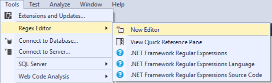
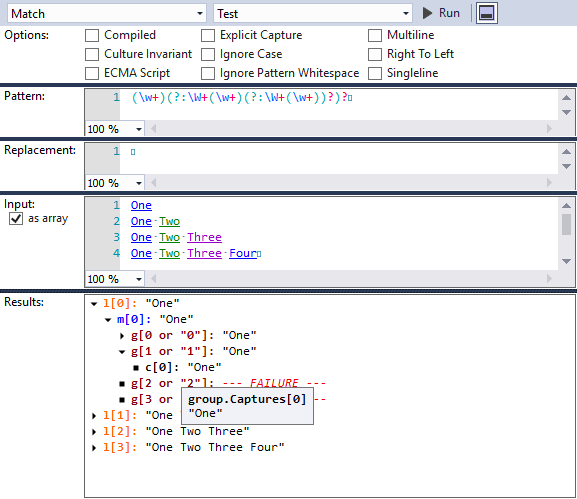
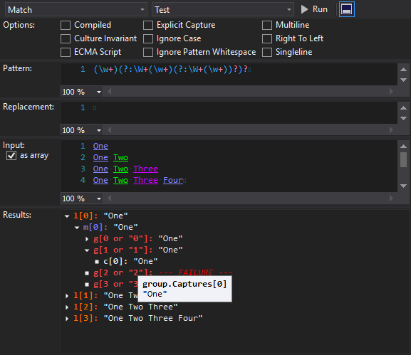
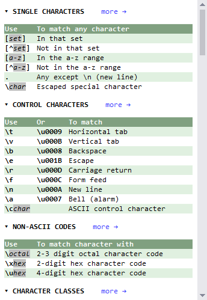
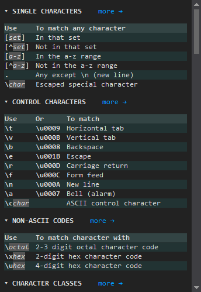

#  Regex Editor ![Visual Studio Marketplace Version][]

[Visual Studio Marketplace Version]: https://img.shields.io/visual-studio-marketplace/v/GeorgyLosenkov.RegexEditorLite

This extension provides tools for Visual Studio 2022 that help you to create regular expressions.

*   **[Regex Editor][]** allows you to create and to test various aspects of the regular expressions
*   **[Quick Ref Pane][]** allows you to keep information on various elements of the regular expressions language handy

[Regex Editor]: #regex-editor
[Quick Ref Pane]: #quick-ref-pane

## How to use it

Open menu **Tools > Regex Editor** and select desired option as shown on the figure below  

## Features

*   Allows to test all main methods of the <a>Regex</a> class: <a>Match</a>, <a>Replace</a>, <a>Split</a>
*   Allows to generate sample code (C# and Visual Basic) using your input
*   Allows to treat input as multiple samples (one sample per line)
*   Provides coloring for pattern
*   Provides coloring for replacement string
*   Provides coloring for input string when testing Match method
*   Highlights segment of the input string corresponding to selected node in the tree when testing Match method

## Screenshots

### Regex Editor
 

### Quick Ref Pane
 
